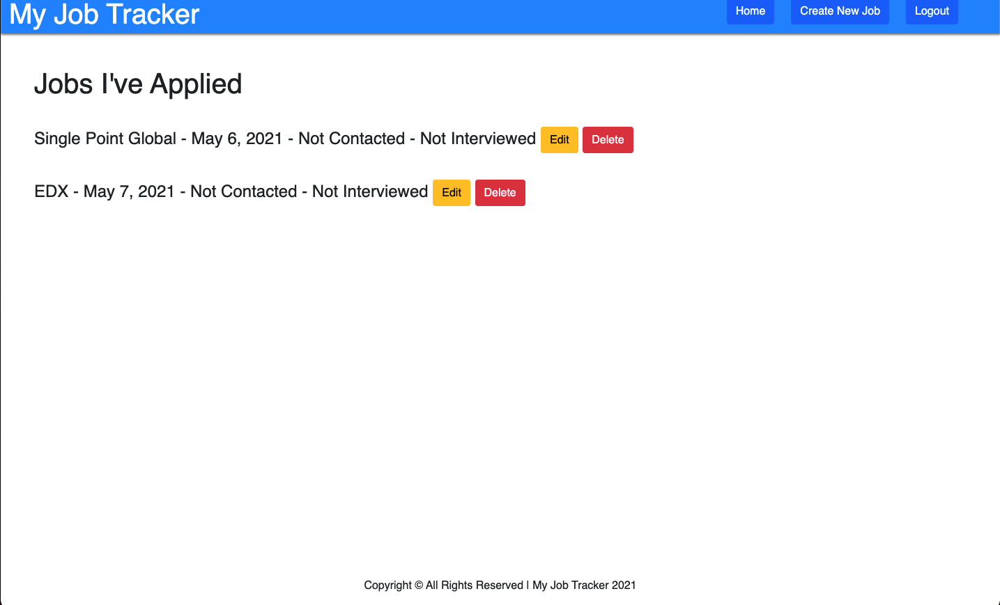

# My Job Tracker

My Job Tracker is a Web App where you can list all the jobs you've been applying to. This is a perfect utility website if you're on the search for a job because it helps you stay organize and helps you keep track of things like if the company as contacted you or not.

## ⚙️ Technologies Used

- CSS/Bootstrap
- HTML5
- Python/Django
- PostgreSQL
- [Github](https://github.com/josedguti/my-job-tracker)
- Heroku

## 📷 Screenshots

## 🔌 Getting Started

[Click](https://my-jobs-tracker-app.herokuapp.com/) to get started and see the app live!

## 🛠 Future enhancements

- Create a section for old jobs you havent get contacted and make the app remind you after 15 days.

## 💣 Unresolved issues

- Website is not well designed for mobile screens at the moment